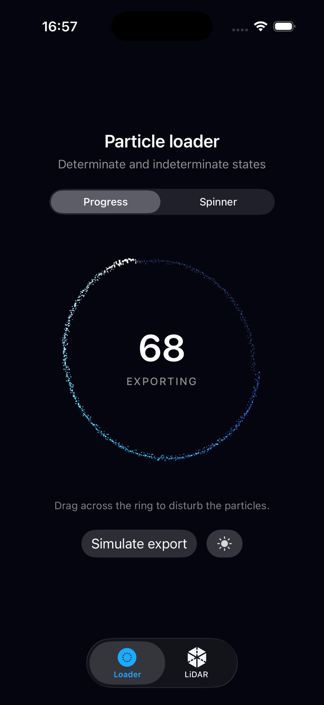

# MetalVisualKit

MetalVisualKit is my exploration of GPU-first UI on iOS: SwiftUI owns the view
lifecycle while Metal handles the per-particle and per-point work. It contains a
particle progress renderer and a LiDAR point cloud, both exposed as SwiftUI views.

[](https://github.com/antonsmedberg/MetalVisualKit/actions/workflows/build.yml)


> **Pre-release.** Xcode 26.6 builds the package, the current test suite, the
> example app and its DocC archive. The loader below ran in an iOS 26.5 simulator. Live
> capture has not run on physical LiDAR hardware. Nothing is tagged; see
> [CHANGELOG](CHANGELOG.md).

<p align="center">
  
</p>
<p align="center"><sub>Verified simulator build; the image is not a LiDAR hardware claim.</sub></p>

<!-- Media/particle-loader.gif and Media/point-cloud.gif go here once recorded
     on device. See Media/README.md. Broken image links are worse than none. -->

## Why I built it

I wanted to see how much frame-by-frame work could stay on the GPU without
turning the public API into a Metal project. The first loader pass looked busy
but wrong: its velocity had moved to pixels per second while the styling curve
still assumed per-frame values, so every sprite hit the size cap. Fixing that
made the timing and visual structure much easier to reason about.

## Open in Xcode

This repository contains two related products:

| Item | Purpose | Location |
|---|---|---|
| `MetalVisualKit` | Reusable Swift Package Manager library | `Sources/MetalVisualKit` |
| `MetalVisualKitDemo` | Example iOS app that consumes the local package | `Examples/MetalVisualKitDemo` |

For development, open the committed workspace rather than opening
`Package.swift` and the demo project in separate Xcode windows:

```sh
git clone https://github.com/antonsmedberg/MetalVisualKit.git
cd MetalVisualKit
xed Examples/MetalVisualKit.xcworkspace
```

Select the **MetalVisualKitDemo** scheme and an iOS simulator. Xcode shows the
library under **Package Dependencies → MetalVisualKit** because the app consumes
the local package at `../..`. Its source remains in `Sources/MetalVisualKit`.

For SwiftUI previews, keep **MetalVisualKitDemo** active. Selecting SwiftPM's
library-only `MetalVisualKit` scheme while viewing a demo source file produces
"Active scheme does not build this file" because that scheme intentionally does
not contain the example app.

## Install

In Xcode, choose **File → Add Package Dependencies**:

```
https://github.com/antonsmedberg/MetalVisualKit
```

No version is tagged yet, so select the `main` branch in Xcode, or:

```swift
.package(url: "https://github.com/antonsmedberg/MetalVisualKit", branch: "main")
```

Once v0.1.0 exists, `from: "0.1.0"` will be the right form.

## Usage

```swift
import MetalVisualKit

// Determinate: pass any progress value
ParticleProgressView(progress: exportProgress, title: "Exporting")
    .frame(width: 320, height: 320)

// Explicit styling when a custom surface differs from the system colour scheme
ParticleProgressView(
    progress: exportProgress,
    surfaceStyle: .light,
    labelColor: .black
)

// Indeterminate
ParticleSpinnerView()
    .frame(width: 240, height: 240)

// Live depth, with automatic fallback to the demo cloud
LiDARPointCloudView(displayMode: .live)
```

The loader draws on a transparent drawable with premultiplied source-over
compositing, so it can sit above video thumbnails, blurred surfaces or other
content. `.automatic` follows the system colour scheme. Use `.light` or `.dark`
when the host surface differs, and optionally set `labelColor` for the centre text.

## Architecture

**Particle loader.** One compute pass updates 1,400 particles around a
spring-controlled ring. Coherent travelling waves lead the motion while curl
noise adds restrained variation; touch can repel the particles, and completion
triggers a short radial release. One
`drawPrimitives(.point)` call renders the result. Swift prepares a compact uniform
struct and encodes the compute and render passes; it does not loop over particles.

**Point cloud.** The ARKit `sceneDepth` map is bound as a texture to the
*vertex* shader rather than read back. Its dimensions are read from the texture
at runtime. A 256×192 map produces roughly 49,000 vertices. Each vertex samples
its own depth pixel, unprojects
through the inverse camera intrinsics, transforms to world space with the camera
pose, and colours itself with a project-specific depth palette. Invalid,
out-of-range and low-confidence samples are culled behind the near plane, while
medium confidence remains visible at reduced opacity. Swift validates the AR frame, prepares camera
matrices and binds the depth and confidence textures. It does not read back or
individually unproject the depth pixels.

## Accessibility

Both components respect **Reduce Motion**. It freezes decorative particle motion
and procedural cloud animation while leaving progress and camera-driven geometry
intact. Settled particle and procedural demo views switch to on-demand drawing
instead of redrawing static frames. Both components expose accessibility labels;
the loader also publishes its percentage to VoiceOver.

## Current rendering defaults

| Knob | Where | Default |
|---|---|---|
| Particle count | `ParticleLoaderRenderer(view:particleCount:)` | 1,400 |
| Frame rate | `MTKView.preferredFramesPerSecond` | 60 |
| Ring radius | `ParticleShaders.metal` | 40% of the shorter side |
| Particle surface | `ParticleSurfaceStyle` | automatic, with explicit light/dark overrides |
| Particle palette | `particleVertex` | surface-aware indigo/cyan arc and sweep head |
| Max scan depth | `LiDARPointCloudView` slider / `maxDepth` | 5 m |
| Confidence floor | `CloudUniforms.minConfidence` | 1 (raw `ARConfidenceLevel`, drops *low*) |
| Point size | `CloudUniforms.pointSize` | 8 layout points, scaled to drawable pixels |
| Colour map | `depthPalette()` in `PointCloudShaders.metal` | blue → cyan → violet → coral |

## Requirements

- **iOS 17+** and Swift tools 6.0.
- CI currently builds with Xcode 26.6 and the iOS 26 SDK. Older compatible Xcode
  versions are not part of the tested matrix.
- Swift 5 language mode by default. See *Swift 6 migration* below.
- Live depth requires a device with a LiDAR scanner. Without one, and in the
  simulator, `LiDARPointCloudView` falls back to a procedural Fibonacci-sphere
  cloud, so previews and the demo app still show something real.
- The host app must declare `NSCameraUsageDescription` for live mode.

## Swift 6 migration

The package uses the Swift 6 toolchain with Swift 5 language mode configured.
The remaining migration work sits around framework callbacks such as
`MTKViewDelegate` and Metal command-buffer completion handlers.

CI runs a non-blocking lane that rewrites `.swiftLanguageMode(.v5)` to `.v6` in
its disposable checkout, then builds with `SWIFT_STRICT_CONCURRENCY=complete`.
`make swift6` performs the same build in a disposable local copy, leaving the
working manifest untouched.
When the advisory build has no concurrency diagnostics, change
`.swiftLanguageMode(.v5)` to `.v6` in `Package.swift`.

## Known limitations

- **No physical LiDAR validation yet.** Only the portrait path has been worked
  through carefully, and no orientation has been confirmed on hardware. Depth
  registration, camera permission recovery, thermal behaviour and GPU frame time
  still need device testing. The orientation derivation follows Apple's
  *Visualizing a Point Cloud Using Scene Depth* sample.
- **Uniform struct layouts are mirrored by hand** between Swift and MSL. Editing
  one side without the other produces a visual glitch rather than a crash.
  `Scripts/check-struct-parity.py` compares the two declarations directly and
  `PipelineTests` pins the resulting strides; both run in CI.
- The point cloud accumulates nothing between frames. It visualises the current
  depth frame, it does not build a persistent scan.
- No adaptive quality policy. Point density, sprite size and frame rate are
  fixed until device profiling provides data for a useful policy.

## Development

```
make build     # build for the iOS simulator
make test      # pipeline, layout, lifecycle, projection and compute tests
make parity    # layouts + simulator selector + Xcode workspace checks
make demo      # build the committed workspace and example app
make project   # regenerate the project after editing project.yml
make lint      # SwiftLint
make docs      # DocC archive
```

The example app lives in [`Examples/MetalVisualKitDemo`](Examples/MetalVisualKitDemo) and
depends on the package by relative path, so it always builds against the working
copy.

Use the demo app for the Xcode Metal Debugger. SwiftPM generates the package
`default.metallib`, and command-line `swift test` may not resolve that bundle on
hosts without a GPU-backed Apple toolchain. CI runs the tests with `xcodebuild`
against an installed simulator.

The `rendering` signpost category records particle compute encoding, particle
render encoding, AR-frame preparation and point-cloud render encoding. Inspect
these intervals in Instruments before making performance claims.

## Contributing

Bug reports are welcome. Please discuss larger changes in an issue first. Pull
requests should keep Swift/MSL layouts in sync and pass `make parity`,
`make test`, `make demo` and `make lint`.

## Privacy

The package collects nothing, tracks nobody, performs no networking and uses no
required-reason APIs. `Sources/MetalVisualKit/PrivacyInfo.xcprivacy` declares this.
Camera permission stays the host app's responsibility.

## Attribution

The camera-orientation transform follows Apple's *Visualizing a Point Cloud
Using Scene Depth* sample. See [`THIRD_PARTY_NOTICES.md`](THIRD_PARTY_NOTICES.md)
for its copyright and permission notice.

## License

MIT. See [LICENSE](LICENSE).
